Подсказки для Prestashop
========================
PrestaShop 1.5.0.0 и выше. 

*Для корректной работы на версиях ниже 1.5.5.0 обратите внимание на дополнительную инструкцию [здесь](#user-content-Установка-на-версии-ниже-1550)*

Выводим подсказки по ФИО и почтовому адресу, автоматически определяем индекс на странице заказа в PrestaShop при помощи сервиса "Подсказки" [DaData.ru] (https://dadata.ru).

По отзывам интернет-магазинов, модуль значительно повышает качество получаемых от пользователей данных. Клиенты начинают указывать почтовые адреса для доставки, разбитые по КЛАДР, без опечаток и с квартирами, индекс определяется автоматически. ФИО вводят без опечаток и с полом.

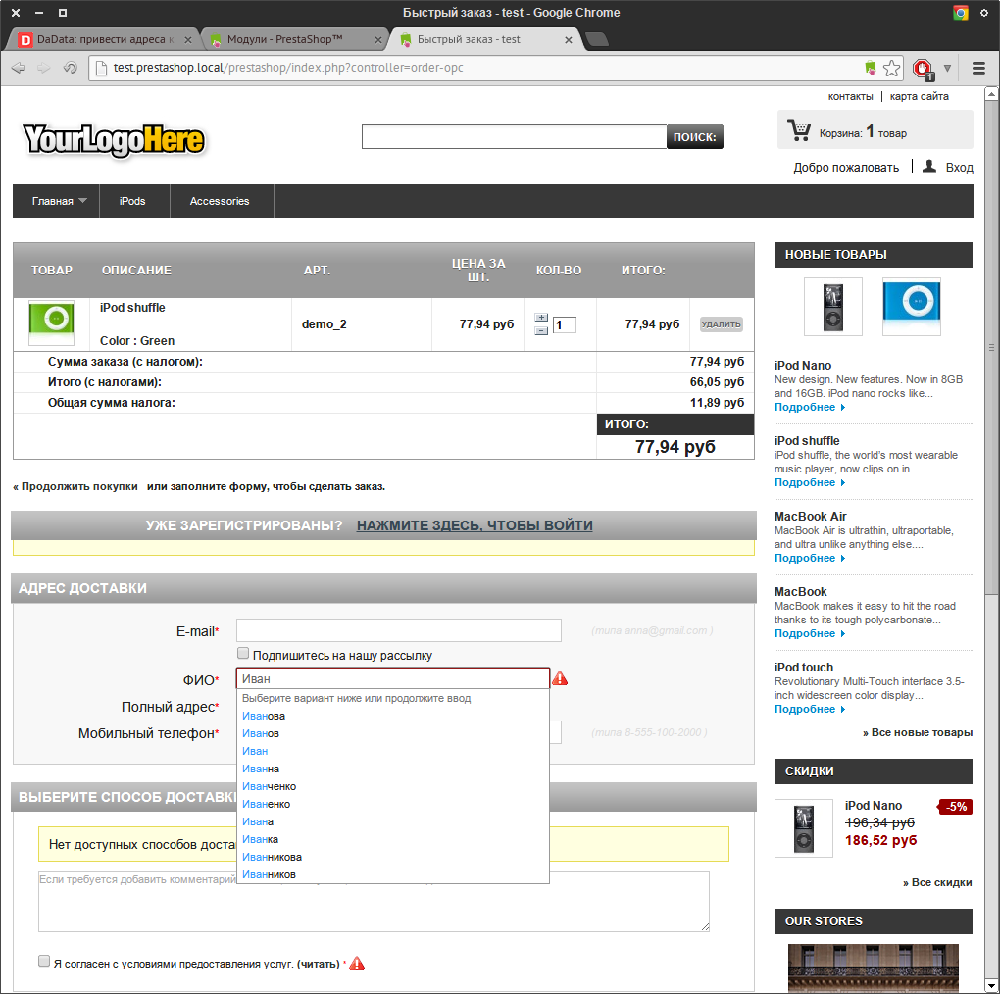
 
Отзыв нашего пользователя про модуль:
просто, удобно, бесплатно. Время установки с получением ключа- минут 5. Получаем читаемый адрес, автоматическое определение индекса, при наборе в латинице предлагает читаемый адрес на кириллице, есть геотаргетинг- в поля адреса автоматически подставляется город и много что еще может. Это отличная система, которая активно развивается. Пробежался по сайту: уже сейчас- по наименованию фирмы или ИП автоматически заполняются остальные реквизиты (ИНН, расчетные счета итп). И все это- (до какого-то безумного количества запросов)- бесплатно. Совет- поставьте модуль на Престу, хотя бы просто- попробовать. 5+

Дистрибутив
-----------

Последняя версия дистрибутива находится [тут] (https://github.com/hflabs/suggestions_prestashop/archive/v1.5.zip)
Установка на версии ниже 1.5.5.0
--------------------------------

К сожалению в версиях Prestashop ниже 1.5.5.0 имеется недоработка, которая не позволяет загрузить разметку для плагина. Для того чтобы это исправить необходимо в любом текстовом редакторе открыть файл _prestashop/classes/Media.php_
Найти следующие строки:

		// check if css files exists
		if (!@filemtime($file_uri))
			return false;

И изменить их содержимое как показано ниже:

		// check if css files exists
		if (!@filemtime($file_uri) && !array_key_exists('host', $url_data)) 
			return false;

Установка
---------
### Распаковка модуля
Распаковать дистрибутив в папку modules рабочей директории prestashop и переименовать suggestions_prestashop-версия в suggestions_prestashop.
### Проверка корректности
В консоли администрирования prestashop выбрать пункт меню "Модули", модуль будет расположен в категории "Оформление заказа".

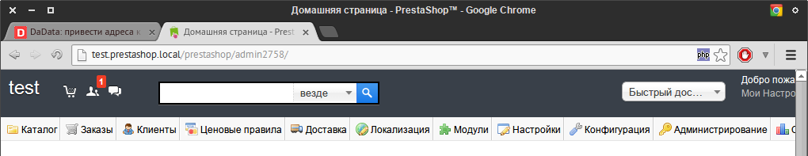

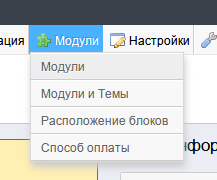

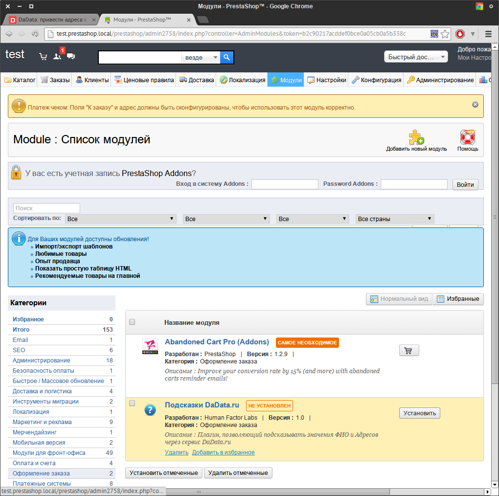

### Получение API токена DaData
Для этого нужно перейти на сайт [DaData] (https://dadata.ru)

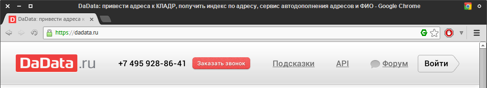

Нажать кнопку "Попробовать бесплатно" в середине страницы и зарегистрироваться.

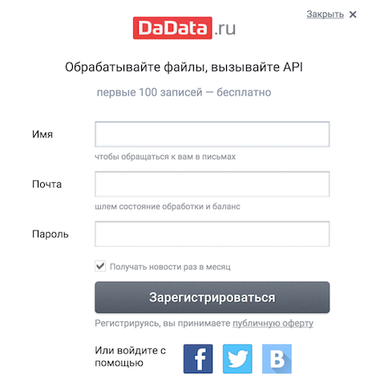

В случае, если у вас уже есть учетная запись, необходимо ввести данные в форме, либо войти через учетную запись любой из предложенных социальных сетей.

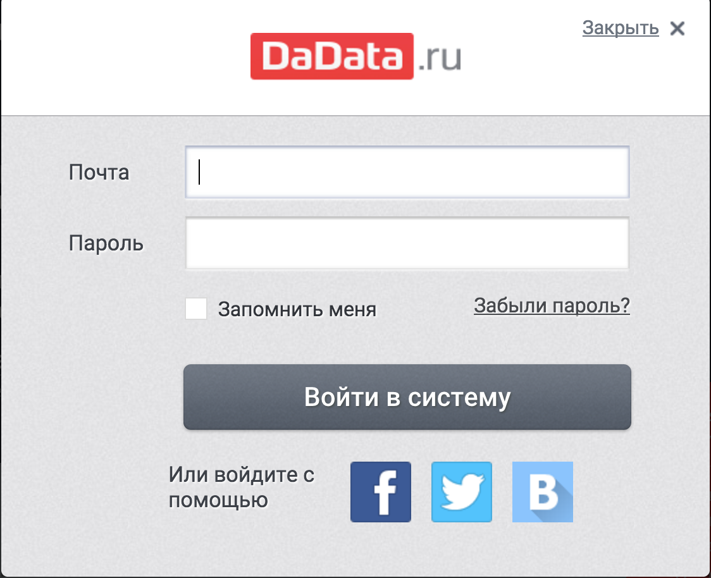

Далее в правом верхнем углу нажать на портфельчик
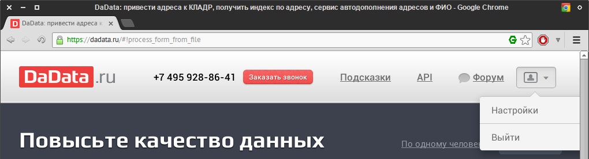

В появившейся форме нажать на ссылку сгенерировать.

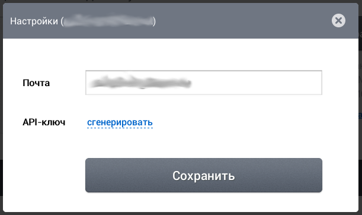

Полученный токен необходимо скопировать.

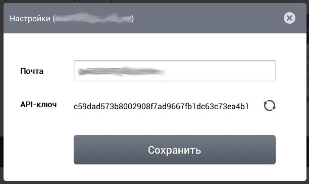

### Включение и настройка плагина
В консоли администрирования нужно нажать кнопку установить напротив модуля "Подсказки DaData.ru"

Вы попадете на страницу настроек плагина

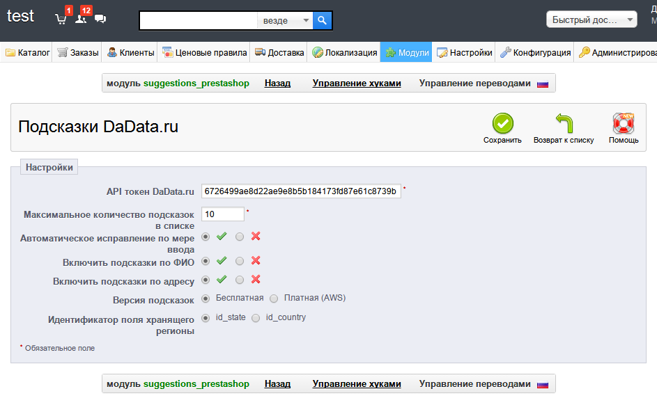

Далее необходимо ввести токен полученный ранее и нажать кнопку "Сохранить"

Плагин готов к работе.

Настройка
---------

Плагин имеет следующие настройки:
* Максимальное количество подсказок в списке - количество строк в выпадающем списке при заполнении.
* Автоматическое исправление по мере ввода - необходимо-ли пытаться исправить слова с опечатками.
* Включить подсказки по ФИО - использовать модуль подсказки для подсказок по ФИО.
* Включить подсказки по адресу - использовать модуль подсказки для подсказок по адресу.
* Версия подсказок - какой сервис использовать при работе (подробнее см. [Версии подсказок] (https://dadata.ru/suggestions/#pricing)).
* Идентификатор поля, хранящего регионы - в каком выпадающем списке заполнены регионы. (id_state - регионы добавлены как штаты России, id_country - регионы указаны как страны)

Использование
-------------

После включения модуля на странице ввода имени и адреса поля гранулярные поля заменяются на единое. При вводе данных выпадает список с наиболее релевантными вариантами заполнения. 

История изменений
-----------------

* 1.5
 * Исправлено дублирование полей в PrestaShop 1.6
* 1.4
 * Исправлены ошибки при работе с Firefox и PrestaShop 1.6
* 1.3
 * Добавлена возможность работы со стандартным заказом (5 шагов)
 * Функциональность подсказок теперь работает на всех формах (в т. ч. и на редактировании адреса)
 * Добавлена настройка идентификатора поля, из которого выбираются регионы России
* 1.2
 * Добавлена возможность выборочно включать подсказки для ФИО или Адреса.
 * Добавлена возможность использования платной версии подсказок (подробнее см. [Версии подсказок] (https://dadata.ru/suggestions/#pricing))
 * Обновлена версия API подсказок
* 1.1
 * Добавлена функциональность отключения подсказок при выборе страны отличной от россии.
* 1.0
 * Первый релиз

Скриншоты
---------
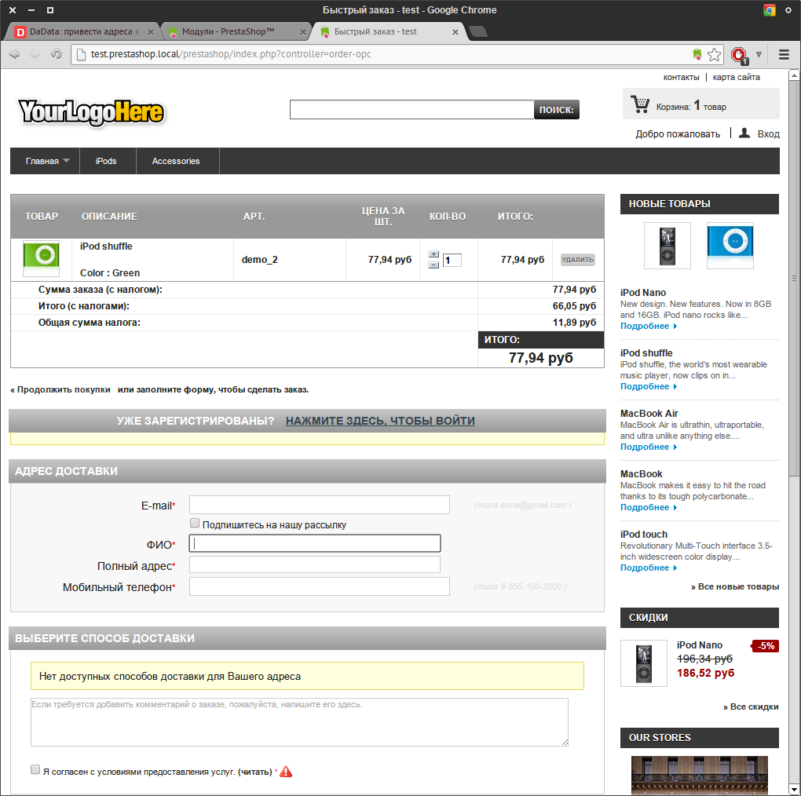

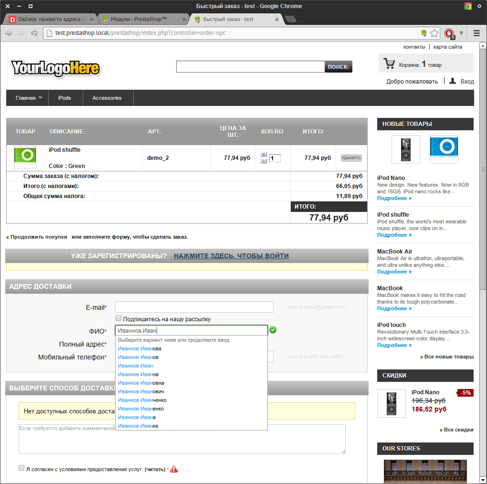
