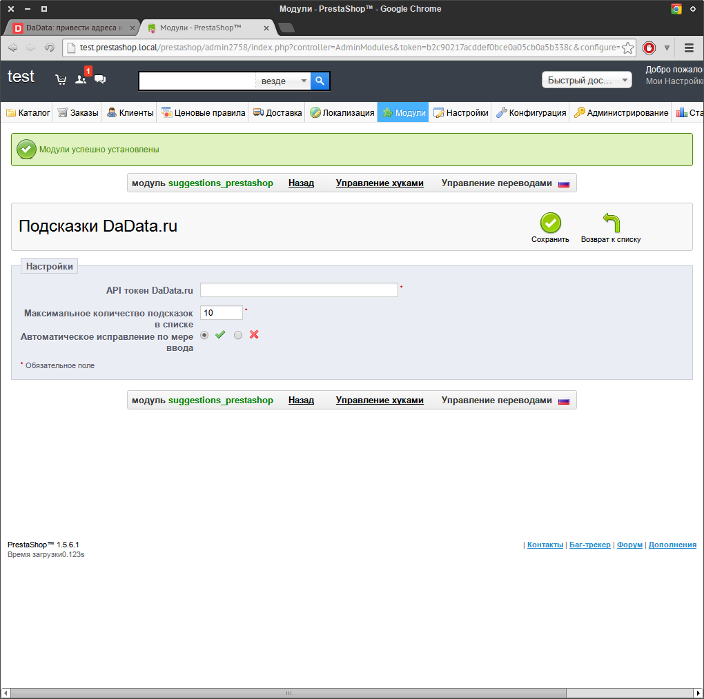

suggestions_prestashop
======================

Описание модуля
---------------

Данный модуль позволяет выводить подсказки по ФИО и адресу (в том числе, автоматически определять индекс) на странице заказа в PrestaShop при помощи сервиса "Подсказки" [DaData.ru] (https://dadata.ru).

Совместимость
-------------

Данный модуль совместим с версиями PrestaShop 1.5 и выше.

Дистрибутив
-----------

Последняя версия дистрибутива находится [тут] (https://github.com/hflabs/suggestions_prestashop/archive/1.0.zip)

Установка
---------
### Распаковка модуля
Распаковать дистрибутив в папку modules рабочей директории prestashop и переименовать suggestions_prestashop-версия в suggestions_prestashop.
### Проверка корректности
В консоли администрирования prestashop выбрать пункт меню "Модули", модуль будет расположен в категории "Оформление заказа".

### Получение API токена DaData
Для этого нужно перейти на сайт [DaData] (https://dadata.ru)

Нажать кнопку "Войти".

В случае, если у вас уже есть учетная запись, необходимо ввести данные в форме, либо войти через учетную запись любой из предложенных социальных сетей.
В случае, если вы хотите зарегистрироваться с помощью e-mail адреса перейдите по ссылке "Это недолго" в верхней части формы и заполните предлагаемые поля.

Далее в правом-верхнем углу необходимо нажать кнопку профиля и выбрать пункт "Настройки"

В появившейся форме нажать на ссылку сгенерировать.

Полученный токен необходимо скопировать.

### Включение и настройка плагина
В консоли администрирования нужно нажать кнопку установить напротив модуля "Подсказки DaData.ru"

Вы попадете на страницу настроек плагина

Далее необходимо ввести токен полученный ранее и нажать кнопку "Сохранить"

Плагин готов к работе.

Настройка
---------

Плагин имеет следующие настройки:
* Максимальное количество подсказок в списке - количество строк в выпадающем списке при заполнении.
* Автоматическое исправление по мере ввода - необходимо-ли пытаться исправить слова с опечатками.

Использование
-------------

После включения модуля на странице ввода имени и адреса поля гранулярные поля заменяются на единое. При вводе данных выпадает список с наиболее релевантными вариантами заполнения. 

Скриншоты
---------

